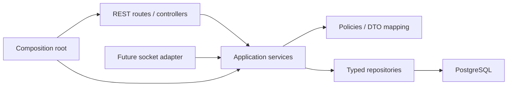

# QForge — Tổ chức backend theo module nghiệp vụ

Cập nhật 10/10/2026. Backend dùng **modular monolith, feature-first, layered architecture**: một ứng dụng Express/PostgreSQL, các module có trách nhiệm rõ ràng. Đây là cấu trúc phù hợp quy mô hiện tại, không phải chứng nhận “enterprise” hay yêu cầu tách thành microservices.

## Bản đồ code

```text
backend/src/
├── app.ts                         # Bootstrap Express, middleware, lắp adapters
├── auth/                          # JWT/HMAC adapters, xác thực và mapping actor
├── common/                        # ApiError, response, HTTP helpers, Database type
├── config/                        # Env, pool và transaction helper
├── middleware/                    # Validation, error handling
├── modules/
│   ├── application.ts             # Composition root: tạo/inject các services
│   ├── api.routes.ts              # Lắp routes, chia Teacher/Guest auth boundary
│   ├── identity/
│   │   └── user.repository.ts     # User lookup và Supabase subject mapping
│   ├── quizzes/
│   │   ├── quiz.routes.ts         # HTTP adapter/controller
│   │   ├── quiz.service.ts        # Get/save/delete/publish use cases
│   │   ├── quiz.repository.ts     # SQL đọc/ghi quiz, question, option
│   │   ├── quiz.policy.ts         # Ownership, edit lock, publish rules
│   │   ├── quiz.queries.ts        # Operations dùng client transaction của caller
│   │   ├── quiz.mapper.ts         # DB rows → Teacher DTO
│   │   └── quiz.types.ts          # Typed persistence rows
│   ├── sessions/
│   │   ├── session.routes.ts
│   │   ├── session.service.ts     # Host/start/next/finish, Teacher snapshot
│   │   ├── session.repository.ts  # Session/settings SQL, PIN savepoint
│   │   ├── session.policy.ts      # Host/version/transition guards
│   │   ├── session.snapshot.ts    # Teacher/Student read model và final metrics
│   │   ├── session.snapshot.repository.ts # Public question và progress queries
│   │   ├── session.mapper.ts      # DB IN_PROGRESS → API ACTIVE
│   │   └── session.types.ts
│   ├── participants/
│   │   ├── participant.routes.ts
│   │   ├── participant.service.ts # Join/retry/resume/revoke
│   │   ├── participant.repository.ts
│   │   └── participant-credentials.ts # Port cho credential adapter
│   ├── answers/
│   │   ├── answer.routes.ts
│   │   ├── answer.service.ts      # Submit/retry, validate và scoring
│   │   └── answer.repository.ts   # Answer/option/attempt persistence
│   ├── reporting/
│   │   ├── report.routes.ts       # Teacher reads và public room metadata
│   │   ├── report.service.ts      # Owner-scoped dashboard/report use cases
│   │   └── report.repository.ts   # Read projections cho dashboard/report
│   └── database-read.ts           # Adapter dev cũ, opt-in và off ở production
└── repositories/index.ts          # Compatibility API cho S04 DB tooling
```

## Trách nhiệm và dependency direction



- **Route/controller**: validate request bằng Zod, lấy actor hoặc Bearer đã xác thực, gọi use case, định dạng response. Với các endpoint hiện tại chỉ cần HTTP handler trong `*.routes.ts`; một controller class chuyển tiếp y hệt sẽ thêm tầng mà không thêm trách nhiệm.
- **Service**: authorization/resource scope, quy tắc nghiệp vụ, retry và transaction boundary. Không import Express, không gọi `db.query` trực tiếp. Services nhận actor/input thuần; REST và Socket.IO dùng lại được.
- **Repository**: SQL có tham số và typed row; không nhận request/response, không tự lấy một connection khác hoặc BEGIN/COMMIT. Cùng một repository factory dùng được pool cho đọc hoặc client đang có transaction.
- **Policy**: ownership, publish eligibility và transition guards; không phụ thuộc HTTP hay database.
- **Queries/read model**: truy vấn theo quyền, assemble DTO trong transaction của caller. `quizQueries` và `sessionSnapshots` không tự mở transaction; tránh gọi service cấp cao từ một transaction đang chạy.
- **Composition root**: `createServices(pool, credentials)` inject dependencies một lần. `createApp` lắp auth và REST adapters. Không dùng global service locator, tự tạo pool trong module hoặc DI framework.
- **Shared contracts**: payload công khai ở `shared/src/contracts.ts`. DB row types nằm cạnh repository; không export token hash hay `is_correct` vào Student DTO.

`repositories/index.ts` giữ API cũ cho migration/seed scripts; user lookup và question reads đã delegate đến repository theo feature. Các API nghiệp vụ không gọi compatibility adapter này. Adapter dev chỉ lấy Teacher cố định khi `ENABLE_DEV_ROUTES=true` và môi trường không phải production.

## Transaction và locking

Mỗi command do service mở **một transaction**, truyền cùng `PoolClient` cho tất cả repositories/read models trong command đó:

```text
transaction(pool, client =>
  lock session → validate → write answer → write option → update attempt → read snapshot
)
```

- Host khóa quiz để serialize với save/delete. PIN unique constraint vẫn là nguồn đảm bảo uniqueness; repository dùng SAVEPOINT để retry đúng lỗi `uq_sessions_active_pin`.
- Join, lifecycle, answer và coherent snapshot khóa cùng session row. Không đổi phạm vi lock khi tách modules.
- Start cập nhật session, tạo attempts và đổi participant status trong cùng transaction.
- Submit lưu answer/option/counters trong cùng transaction. Retry cùng option không ghi hoặc cộng điểm nữa; retry khác option trả conflict.
- Finish cập nhật session/attempts/participants cùng transaction. Kết quả tính theo counts và tổng câu hỏi.
- Repository không commit; socket adapter chỉ emit sau khi lời gọi service đã resolve, tức transaction đã commit. Không emit bên trong transaction callback.

## Điểm nối realtime

```ts
const services = createServices(pool, participantCredentials);
const state = await services.sessions.action(actor, sessionId, 'next', expectedVersion);
// Transaction đã commit; socket adapter lúc này mới phát đúng audience.
```

Các service công khai: `quizzes.get/save/publish/delete`, `sessions.host/snapshot/action`, `participants.join/snapshot/revoke`, `answers.submit`, `reports.dashboard/quiz/session/openRoom`. Auth socket tái sử dụng `resolveTeacher` và credential resolver; không nhận actor/participantId trần từ client. Snapshot Student giữ projection không có đáp án đúng.

## Kiểm tra và quy tắc khi thêm tính năng

- `npm run check`: lint, typecheck, integration/HTTP tests, FE smoke và builds.
- ESLint chặn Express/HTTP imports trong services, SQL trực tiếp trong services, database/repository imports trong routes và service/route imports trong repositories. Đây là guardrail tĩnh; review vẫn phải kiểm tra quyền, transaction và các lỗi nghiệp vụ.
- `backend/test/application.integration.test.ts` kiểm tra nhiều module cùng engine PostgreSQL WASM: ownership/publish, flow gameplay, retry, JWT/HTTP, report và rollback xuyên module. Nó không giả lập transaction bằng mock repository.
- Regression mới ép start/answer/finish lỗi giữa chừng để xác nhận session, answer/options, attempt và participant cùng rollback. HTTP flow đi qua các router đã tách, kiểm tra Teacher/Guest không dùng nhầm credential và host khác không đọc report.
- Thêm rule vào policy/service, SQL vào repository, payload công khai vào shared; sửa docs/contract và viết kiểm thử theo hành vi có rủi ro. Không tạo generic BaseRepository/BaseService để che các truy vấn và transaction cụ thể.

Refactor giữ nguyên REST endpoints, response shapes, DB schema và business rules. Supabase Auth thật/migration 002/Teacher mapping, PostgreSQL concurrency nhiều connections, browser responsive, H01 và deploy vẫn chưa được nghiệm thu. Các thay đổi được lưu bằng commit local trên feature branch; chưa push.
