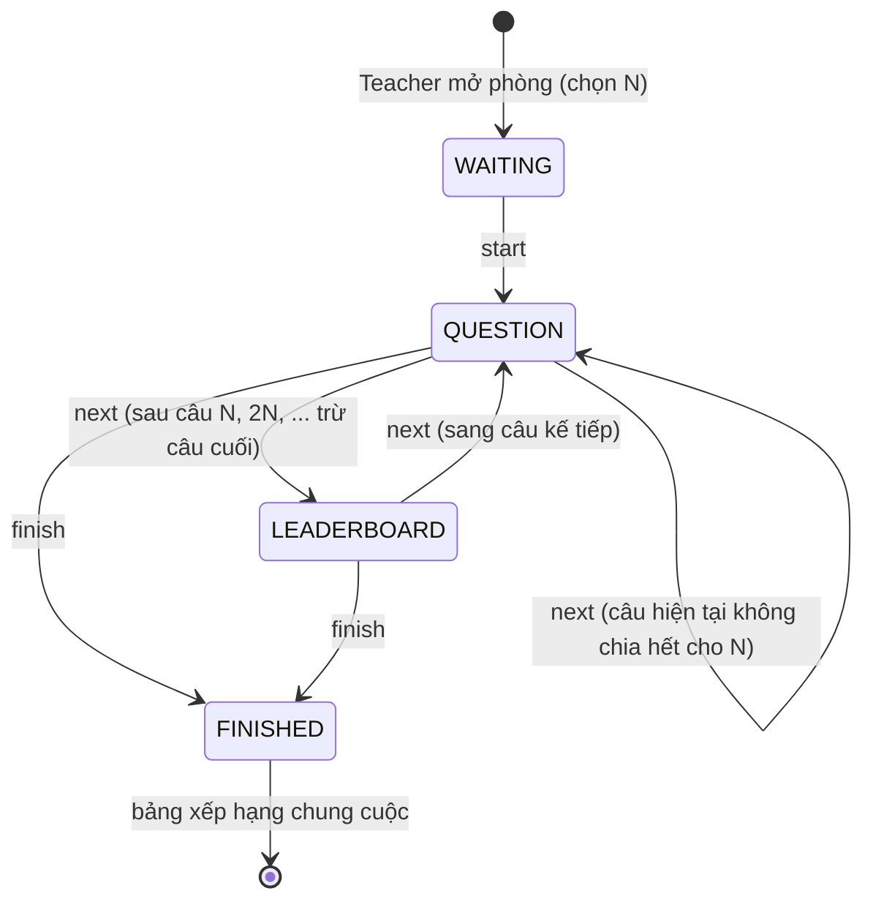
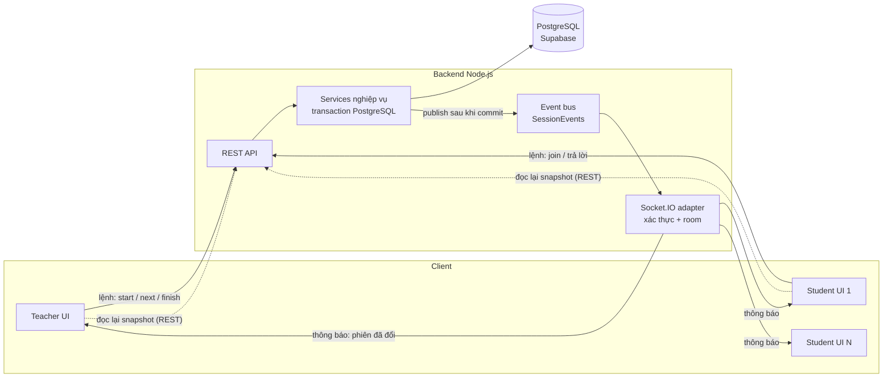
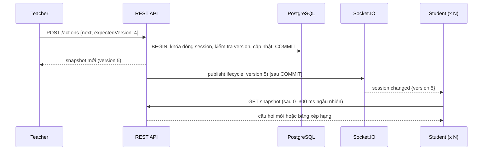

# QForge — Thiết kế tính năng Real-time và Bảng xếp hạng

Tài liệu mô tả phần realtime của đồ án QForge: bài toán, các lựa chọn thiết kế và lý do, cách đảm bảo đúng đắn và bảo mật, kết quả kiểm thử và các giới hạn hiện tại. Đặc tả kỹ thuật ngắn gọn cho nhóm phát triển nằm ở [realtime-leaderboard.md](realtime-leaderboard.md).

## 1. Bài toán

QForge là hệ thống quiz trực tiếp trong lớp học. Giảng viên (Teacher) mở một phiên (Live session) từ đề đã xuất bản và chia sẻ mã PIN 6 chữ số. Nhiều sinh viên (Student) dùng PIN để tham gia cùng một phiên, không cần tài khoản.

Trước khi có realtime, Student phải tự bấm "Cập nhật phiên" mới thấy câu hỏi mới. Teacher cũng phải bấm "Cập nhật phòng" để biết ai đã vào và ai đã trả lời. Cách này không phù hợp với một hoạt động diễn ra đồng thời cho cả lớp.

Yêu cầu của phần này:

1. Khi Teacher bắt đầu, chuyển câu hoặc kết thúc, màn hình của mọi Student trong phiên cập nhật ngay, không cần thao tác.
2. Teacher theo dõi trực tiếp bảng xếp hạng, danh sách người tham gia và số người đã trả lời câu hiện tại.
3. Student xem **bảng xếp hạng chung sau mỗi N câu**, với N do Teacher chọn khi mở phòng (giới hạn 1–10 cho bản demo). Bảng xếp hạng chung cuộc luôn hiện khi kết thúc.
4. Không làm lộ đáp án, không cho Student xem dữ liệu của phiên khác, và không làm sai lệch điểm khi mạng chập chờn hoặc thao tác bị gửi lặp.

## 2. Luồng nghiệp vụ

### 2.1. Trạng thái của một phiên

Phiên có ba trạng thái chính: chờ (`WAITING`), đang chạy (`ACTIVE`) và đã kết thúc (`FINISHED`). Trong lúc đang chạy, phiên ở một trong hai bước: **đang mở câu hỏi** (`QUESTION`) hoặc **đang xem bảng xếp hạng** (`LEADERBOARD`).

Ví dụ với N = 2 và đề 5 câu: Câu 1 → Câu 2 → **Bảng xếp hạng** → Câu 3 → Câu 4 → **Bảng xếp hạng** → Câu 5 → Kết thúc → **Bảng xếp hạng chung cuộc**.

Bước bảng xếp hạng do Teacher điều khiển: Teacher bấm "Hiện bảng xếp hạng" để cả lớp cùng xem, rồi bấm "Câu tiếp theo" khi muốn đi tiếp. Nhóm chọn cách này thay vì hiện bảng xếp hạng kèm câu hỏi kế tiếp, vì Teacher giữ được nhịp lớp học (có thể dừng lại nhận xét), và bản demo chưa có timer.

### 2.2. Quy tắc xếp hạng

- Mỗi câu đúng được 100 điểm. Xếp theo điểm giảm dần; **cùng điểm thì cùng hạng** (kiểu 1, 1, 3).
- Student nhận top 10, hạng của chính mình và tổng số người tham gia.
- Teacher nhận toàn bộ bảng xếp hạng ở mọi thời điểm.
- **Student không bao giờ nhận bảng xếp hạng khi câu hỏi đang mở.** Nếu điểm thay đổi ngay sau khi một bạn vừa trả lời, người khác có thể suy ra bạn đó đúng hay sai, tức là đoán được đáp án. Vì vậy bảng xếp hạng chỉ được gửi ở bước `LEADERBOARD` hoặc sau khi kết thúc.
- Trong bước bảng xếp hạng, server từ chối câu trả lời mới. Lần gửi lại y hệt một câu trả lời đã lưu vẫn được chấp nhận (idempotent) và không cộng điểm lần hai.

## 3. Lựa chọn công nghệ

| Phương án | Ưu điểm | Nhược điểm | Kết luận |
|---|---|---|---|
| Polling định kỳ (client hỏi server mỗi vài giây) | Đơn giản, không cần thêm hạ tầng | Trễ đến vài giây; tải lớn và lãng phí khi cả lớp liên tục hỏi | Chỉ dùng làm **phương án dự phòng** khi mất kết nối |
| Server-Sent Events (SSE) | Một chiều server → client, nhẹ | Tự xử lý phòng/nhóm người nhận, reconnect, xác thực | Không chọn |
| Supabase Realtime | Có sẵn trong Supabase mà dự án đang dùng | Student không có tài khoản Supabase mà dùng token riêng của hệ thống; phải tự viết thêm phân quyền kênh | Không chọn |
| **Socket.IO (WebSocket)** | Có sẵn room, tự reconnect, xác thực khi bắt tay, gắn chung vào server Express hiện có | Thêm một thư viện; khi chạy nhiều server cần adapter chia sẻ | **Chọn** |

Socket.IO cho phép gắn trực tiếp vào HTTP server Node.js hiện có, dùng lại toàn bộ cơ chế xác thực Teacher (Supabase JWT) và Student (token riêng), và có sẵn khái niệm room để gửi đúng nhóm người nhận.

## 4. Kiến trúc

### 4.1. Nguyên tắc chính: socket chỉ "báo có thay đổi"

Quyết định thiết kế quan trọng nhất: **socket không mang dữ liệu nghiệp vụ.** Server chỉ gửi một thông báo ngắn kiểu "phiên X vừa thay đổi (phiên bản 5)". Client nhận thông báo rồi tự gọi API REST có sẵn để lấy trạng thái mới, đúng với quyền của mình.

Lý do chọn mô hình "thông báo + đọc lại" thay vì đẩy thẳng dữ liệu qua socket:

- **Bảo mật đơn giản và nhất quán.** Quyền xem dữ liệu chỉ kiểm tra ở một nơi là REST API, nơi đã có test. Dữ liệu của Student (không có cờ đáp án đúng) và của Teacher (đầy đủ) không bao giờ bị lẫn qua socket, vì socket không chở dữ liệu.
- **Không phải viết lại nghiệp vụ.** Các lệnh ghi như join, trả lời, chuyển câu vẫn đi qua REST. Phần REST đã có sẵn transaction, chống gửi lặp và 34 test tự động.
- **Dễ phục hồi khi mất kết nối.** Thông báo nào bị lỡ cũng không sao, vì mỗi lần kết nối lại, client đọc lại toàn bộ trạng thái hiện tại.

Đánh đổi: mỗi lần Teacher chuyển bước, mỗi Student gửi một request REST. Với quy mô một lớp học (vài chục đến khoảng một trăm người) thì không đáng kể. Để tránh N request đến cùng một lúc, mỗi Student chờ ngẫu nhiên 0–300 ms rồi mới đọc.

### 4.2. Ai nhận thông báo gì

| Sự kiện | Người nhận | Thời điểm |
|---|---|---|
| `session:changed` (lifecycle) | Mọi Student của phiên và Teacher | start, next, finish |
| `session:changed` (roster / answer) | Chỉ Teacher, **gộp tối đa 1 lần mỗi 300 ms** | Có người vào/rời phòng, có câu trả lời mới |
| `session:revoked` | Đúng Student đó, sau đó server ngắt kết nối | Student rời phiên |

Gộp thông báo cho Teacher: nếu 50 Student trả lời trong 2 giây, Teacher không nhận 50 thông báo (tương đương 50 lần tải lại), mà chỉ khoảng 7 lần. Student không nhận thông báo khi bạn khác trả lời, vì màn hình của họ không đổi.

### 4.3. Một vòng chuyển câu

### 4.4. Các thành phần trong mã nguồn

| Thành phần | Vai trò |
|---|---|
| `shared/src/contracts.ts` | Định nghĩa chung cho cả FE và BE (Zod): bảng xếp hạng, bước của phiên, input mở phòng, tên và nội dung event, hàm `nextOpensLeaderboard` |
| `backend/src/modules/session-events.ts` | "Cổng" phát sự kiện, không phụ thuộc Socket.IO, nên test nghiệp vụ không cần socket |
| `backend/src/modules/sessions/*` | Logic chuyển bước, bảng xếp hạng (SQL `RANK()`), phát sự kiện sau commit |
| `backend/src/realtime/socket.ts` | Adapter Socket.IO: xác thực khi bắt tay, gán room, gộp thông báo |
| `database/migrations/003_live_leaderboard.sql` | Thêm cột `leaderboard_every` (N) và `live_phase` (bước hiện tại) |
| `frontend/src/lib/realtime.ts` | Client: kết nối, tự kết nối lại, poll dự phòng khi mất kết nối |
| `frontend/src/features/core/*` | Giao diện chọn N, bảng xếp hạng trực tiếp của Teacher, màn bảng xếp hạng của Student |

Kiến trúc backend giữ nguyên hướng "modular monolith": service không phụ thuộc HTTP hay Socket.IO, nên cùng một service phục vụ được cả REST lẫn realtime. Quy tắc ESLint sẵn có (cấm service import Express hoặc viết SQL trực tiếp) vẫn được tuân thủ.

## 5. Tính đúng đắn và nhất quán

- **Chỉ phát sự kiện sau khi transaction đã commit.** Nếu phát trước mà transaction bị rollback, client sẽ đọc phải trạng thái chưa từng tồn tại. Service chỉ gọi `publish` sau khi lệnh trong transaction đã hoàn tất.
- **Khóa theo phiên.** Mọi lệnh ghi (join, trả lời, chuyển bước) đều khóa cùng một dòng `sessions` (`SELECT … FOR UPDATE`). Vì vậy câu trả lời gửi đúng lúc Teacher chuyển câu được xử lý tuần tự, không có trạng thái lưng chừng.
- **Số phiên bản (`stateVersion`).** Mỗi lần chuyển bước, phiên bản tăng 1. Lệnh của Teacher phải gửi kèm phiên bản đang thấy; nếu bấm hai lần hoặc gửi lặp thì lần sau bị từ chối (409), không thể nhảy hai câu. Phía client bỏ qua dữ liệu có phiên bản cũ hơn dữ liệu đang hiển thị, để một response đến muộn không ghi đè trạng thái mới.
- **Gửi lặp an toàn.** Gửi lại cùng một câu trả lời không cộng điểm lần hai; gửi một lựa chọn khác cho câu đã trả lời thì bị từ chối.
- **Tương thích ngược với DB dùng chung.** Migration 003 chỉ thêm cột cho phép NULL. Code cũ (chưa biết đến cột mới) vẫn chạy được trên cùng DB; code mới hiểu `live_phase` rỗng của phiên đang chạy là "đang mở câu hỏi".

## 6. Bảo mật

- **Xác thực ngay khi bắt tay.** Teacher gửi Supabase JWT; server kiểm tra chữ ký, issuer, audience, hạn dùng, tài khoản đã liên kết và **đúng là chủ phiên**. Student gửi token riêng; server so khớp HMAC đã lưu, kiểm tra hạn và đúng phiên.
- **Server tự gán room.** Client không được chọn room. Có test cho trường hợp gửi kèm tên room giả: kết nối bị từ chối.
- **Socket không chở dữ liệu nhạy cảm.** Có test tự động kiểm tra rằng payload không chứa điểm, đáp án, lựa chọn hay tên người dùng.
- **Rời phiên là ngắt kết nối ngay.** Khi Student rời phiên, token bị thu hồi, socket bị ngắt và không kết nối lại được bằng token cũ.
- **Không lộ đáp án qua bảng xếp hạng** (mục 2.2).

## 7. Khả năng chịu lỗi phía client

- Khi kết nối hoặc kết nối lại: client đọc lại snapshot ngay để bù các thông báo đã lỡ.
- Khi mất kết nối: giao diện hiện "Mất kết nối realtime, đang thử lại…" và chuyển sang poll REST mỗi 10 giây cho tới khi kết nối lại.
- Teacher lấy access token mới ở mỗi lần kết nối lại (token Supabase hết hạn sau khoảng 1 giờ).
- Nút "Cập nhật phiên/phòng" vẫn được giữ làm phương án thủ công cuối cùng.

## 8. Kiểm thử

### 8.1. Kiểm thử tự động

Chạy bằng `npm run check` (cũng chạy trong CI GitHub Actions): lint, typecheck, test backend, smoke test frontend và build. Test backend dùng PostgreSQL thật chạy trong bộ nhớ (PGlite) và client Socket.IO thật.

| Nhóm | Nội dung kiểm tra |
|---|---|
| Nghiệp vụ bảng xếp hạng | Bước bảng xếp hạng sau mỗi N câu; không có sau câu cuối; xếp hạng đồng hạng (1, 1, 3); Student không nhận bảng xếp hạng khi câu đang mở; chặn trả lời ở bước bảng xếp hạng; gửi lại vẫn idempotent; N được giữ nguyên sau khi bắt đầu; dữ liệu từ code cũ được hiểu đúng; giới hạn N từ 1 đến 10 |
| Realtime | Từ chối khi thiếu xác thực, token sai, Teacher không phải chủ phiên, token của phiên khác, hoặc tự chọn room; thông báo chỉ đến đúng phiên; Student không nhận thông báo khi bạn khác trả lời; thông báo cho Teacher được gộp; payload không chứa dữ liệu chấm điểm; rời phiên thì bị ngắt và không kết nối lại được |
| Hồi quy | Toàn bộ 34 test có sẵn (transaction, rollback, JWT, quyền sở hữu, HTTP) và 2 bộ smoke test frontend vẫn qua |

Kết quả: **39/39 test backend và 2/2 smoke test frontend đạt.**

### 8.2. Chạy thử trên hệ thống thật

Chạy ngày 10/10/2026 trên DB Supabase của dự án, backend chạy local, tài khoản Teacher thật, 2 Student giả lập, N = 1:

| Bước | Kết quả quan sát |
|---|---|
| Kết nối socket với token giả | Bị từ chối, lỗi `UNAUTHORIZED` |
| Câu 1: Ann trả lời đúng, Bob trả lời sai | Teacher thấy ngay Ann #1 (100 điểm), Bob #2 (0 điểm); Student không nhận bảng xếp hạng |
| Teacher bấm Next | Chuyển sang bước bảng xếp hạng; Bob không thấy câu hỏi, thấy bảng xếp hạng và hạng #2 của mình |
| Teacher bấm Next lần nữa | Sang câu 2 |
| Teacher bấm Kết thúc | Bảng xếp hạng chung cuộc: Ann #1, 100 điểm |
| Thông báo socket | Mỗi lần chuyển bước, cả 2 Student và Teacher đều nhận; thông báo câu trả lời chỉ đến Teacher |

## 9. Giới hạn và hướng phát triển

Những điểm **chưa** được kiểm chứng hoặc chưa làm:

- **Chưa kiểm thử tải.** Chưa đo với hàng trăm kết nối đồng thời. Hướng tiếp theo: dùng k6 hoặc Artillery mô phỏng 100–200 Student, đo độ trễ từ lúc Teacher bấm đến lúc Student thấy câu mới và tải của DB.
- **Chưa nghiệm thu trên trình duyệt với lớp học thật**, bao gồm điện thoại và mạng di động.
- **Chạy một server.** Một tiến trình Node.js đủ cho một lớp học. Nếu cần nhiều server, dùng `@socket.io/redis-adapter` để chia sẻ room và bật sticky session ở load balancer.
- **Deploy** cần nền tảng hỗ trợ WebSocket lâu dài (ví dụ Render, Railway, Fly.io); các nền tảng serverless như Vercel Functions không phù hợp cho backend realtime.
- Bản demo **không có timer**, không có điểm thưởng tốc độ, không trộn câu hỏi. Đây là các mở rộng tự nhiên tiếp theo; timer đặc biệt hợp với kiến trúc hiện tại vì server có thể tự chuyển bước và phát cùng thông báo `lifecycle`.
- Có thể tối ưu thêm bằng cách đẩy phần trạng thái chung (câu hỏi hiện tại) qua socket để Student không phải đọc lại, nhưng sẽ phải kiểm soát kỹ hơn dữ liệu đi qua socket. Nhóm chọn ưu tiên sự đơn giản và an toàn cho bản demo.
