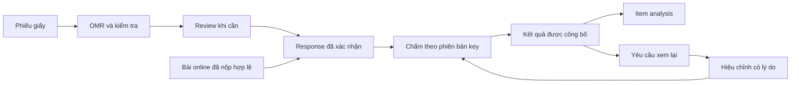

# RESEARCH REPORT — Paper/OMR, Grading & Item Analysis

**Member:** Hộp  
**Research Domain:** Paper/OMR, Grading & Item Analysis  
**Project:** Intelligent Assessment Platform  
**Date:** 30/09/2026  

**Tóm tắt:** Báo cáo đề xuất ba thành phần liên kết: **OMR có kiểm tra trường hợp không chắc → kết quả chấm có phiên bản và truy vết → item analysis từ dữ liệu đã xác nhận**. OMR là nhận diện các ô đã tô trên phiếu; item analysis là xem dữ liệu trả lời để kiểm tra chất lượng từng câu hỏi.

Các thành phần trên đã xuất hiện trong những sản phẩm được khảo sát. Trọng tâm đánh giá của đồ án là độ chính xác, khối lượng kiểm tra thủ công và khả năng truy vết kết quả trong điều kiện sử dụng xác định. Tính mới và mức cải thiện so với các giải pháp hiện có cần được kiểm chứng bằng nghiên cứu chuyên sâu và thực nghiệm.

## 1. Research Objective

### 1.1. Mục tiêu và câu hỏi

Báo cáo khảo sát ba lĩnh vực: bài giấy/OMR, chấm điểm và phân tích câu hỏi, theo [tài liệu phân công nghiên cứu](https://namdin05.github.io/testing-demo/research-assignment/). Mục tiêu là xác định năng lực của các giải pháp hiện có, yêu cầu dữ liệu và hướng triển khai phù hợp với phạm vi đồ án.

- **RQ1:** Sản phẩm hiện có xử lý phiếu giấy, lỗi nhận diện và người chấm kiểm tra như thế nào?
- **RQ2:** Cần dữ liệu và workflow gì để bài giấy và online đi vào cùng quy trình chấm, sửa điểm và công bố?
- **RQ3:** Item analysis nào có thể làm hữu ích với nguồn lực và dữ liệu của đồ án, và phải tránh diễn giải sai ở đâu?

### 1.2. Phương pháp và giới hạn khảo sát

Báo cáo đối chiếu tài liệu chính thức của **ZipGrade, Gradescope, Azota, Moodle và Canvas**; dùng OMRChecker/OpenCV làm tham chiếu kỹ thuật, University of Washington và ETS làm nguồn cho giới hạn đánh giá. Thời điểm đối chiếu tài liệu: **30/09/2026**.

Phương pháp sử dụng là **khảo sát tài liệu (desk research)**. Nhận định về tính năng dựa trên tài liệu chính thức; báo cáo chưa bao gồm benchmark trực tiếp hoặc dữ liệu bài làm thực tế. Những tính năng không được đề cập trong nguồn khảo sát được xem là chưa xác minh.

- **Tin cậy cao:** các workflow được tài liệu chính thức mô tả.
- **Tin cậy trung bình:** độ phức tạp và khả năng triển khai, phụ thuộc vào prototype, dữ liệu và nguồn lực triển khai.
- **Chưa xác lập:** tính mới nghiên cứu, hiệu quả thực nghiệm, ngưỡng accuracy và dữ liệu pilot.

> Đây là suy luận: Phân tích khoảng trống, thiết kế và kế hoạch đánh giá trong báo cáo được xây dựng từ các nguồn khảo sát. Các nội dung này là đề xuất nghiên cứu; quy mô bộ thử và metric chưa phải kết quả thực nghiệm.

## 2. Existing Solutions

| Product / tài liệu | Relevant Feature | How It Works | Strength | Limitation / điều kiện đã xác minh | Source |
|---|---|---|---|---|---|
| **ZipGrade** | Scan điện thoại, phiếu chuẩn/tùy chỉnh, sửa nhận diện, nhiều key, item analysis, quiz online, CSV | Giáo viên chọn form và key; scan rồi review. Tùy chọn “Map Each Question” nối câu ở key phụ về key chính. | Bao phủ cả bài scan và online; là đối chiếu trực tiếp cho bài toán của nhóm. | Với cách “Provide Answers” cho key riêng, tài liệu nêu không có item analysis cho học sinh dùng key đó. Ánh sáng phản chiếu, ảnh thiếu nét và form sai gây lỗi scan. | [Tổng quan][Z1], [multiple keys][Z2], [scan failures][Z3], [sửa đáp án][Z4] |
| **Gradescope** | Bubble Sheet, nhiều version, uncertain-mark review, rubric/regrade, CSV, thống kê từng câu | Upload bản scan; hệ thống đọc version và đáp án; người chấm xác nhận ô chưa rõ. Chỉnh rubric có thể tác động nhiều bài liên quan. | Workflow review và chấm lại rõ ràng; có đường đi từ bài giấy đến dữ liệu từng câu. | Bubble Sheet dùng mẫu cố định, cần Institutional license theo tài liệu. Discrimination của phần này chỉ áp dụng với Exact scoring; câu toàn đúng/toàn sai trả N/A. | [Tạo Bubble Sheet][G1], [chấm và review][G2], [phúc khảo][G3] |
| **Azota** | Chấm phiếu bằng camera, sửa nhận diện đáp án/mã đề/SBD; thống kê thi online | App chụp phiếu; giáo viên kiểm tra và chỉnh trước khi lưu. Dashboard online có phổ điểm và tỷ lệ đúng/sai theo câu. | Là ví dụ triển khai phù hợp bối cảnh sử dụng tiếng Việt; sửa cả định danh lẫn đáp án trên bước review. | Cần đúng mẫu và tỷ lệ in, giữ điểm neo. Tài liệu thống kê online không đủ chứng minh một schema gộp paper/online ở bên trong sản phẩm. | [Chấm phiếu trên app][A1], [lỗi nhận diện][A2], [thống kê đề thi][A3] |
| **Moodle Quiz** | Quiz statistics, facility, discrimination, phân bố response, export | Báo cáo tổng thể và từng câu; drill-down vào phương án trả lời; chọn lần đầu hoặc các lần làm theo tùy chọn. | Là mẫu tham khảo cho analytics phục vụ giảng viên, từ biểu đồ đến điều tra một câu có vấn đề. | Một số giả định thống kê không phù hợp khi gộp nhiều lần làm; response analysis tùy loại câu và không áp dụng cho câu tự luận ở view này. | [Quiz statistics report][M1] |
| **Canvas Quizzes** | Classic: thống kê và CSV; New Quizzes: Quiz/Item Analysis, Student Analysis CSV, corrected item-total correlation | Sinh báo cáo từ bài làm, xem câu hỏi và tần số lựa chọn, tải CSV. | Tài liệu mô tả khá rõ mẫu số và cách tính, hữu ích để định nghĩa metric của đồ án. | Classic và New Quizzes có hành vi khác nhau. Classic dùng so sánh nhóm trên/dưới trong chỉ số discrimination; New Quizzes có corrected correlation và policy lấy lần làm cuối. Điều kiện ≥3 submissions để sinh report không chứng minh đủ mẫu thống kê. | [Classic statistics][C1], [New reports][C2], [New calculations][C3] |
| **OMRChecker — tham chiếu kỹ thuật** | Đọc phiếu từ ảnh/scan, cấu hình layout, xuất response/score | Repo mã nguồn mở dùng template cấu hình và quy trình xử lý ảnh; có mẫu và ảnh debug. | Có thể dùng làm baseline hoặc học cách tách mẫu phiếu với chấm đáp án. | Hiệu năng tự công bố cần được kiểm chứng trên bộ dữ liệu và cấu hình của đồ án. | [Repo chính thức][O1] |

**Nhận định từ khảo sát:** OMR, hiệu chỉnh đáp án, rubric, phúc khảo và thống kê đều đã có tiền lệ. Đóng góp nghiên cứu cần được xác định qua câu hỏi đánh giá cụ thể, baseline và kết quả so sánh.

## 3. Feature Inventory

**Tiêu chí đánh giá:** User Value là ích lợi cho giảng viên/sinh viên; Research Value là tiềm năng nghiên cứu thêm trong đồ án, không phải tính mới đã chứng minh. Complexity ước lượng khối lượng triển khai và kiểm chứng trong phạm vi nhóm. C/TB/T = cao/trung bình/thấp. Phạm vi đề xuất sử dụng các mức MVP/Advanced/Research/Stretch trong tài liệu dự án.

| ID | Feature | Existing Products / bằng chứng | User Value | Research Value | Complexity / scope đề xuất |
|---|---|---|---|---|---|
| F01 | Mẫu phiếu có cấu trúc, vị trí ô xác định | [ZipGrade][Z1], [Gradescope][G1] | C — in và dùng thống nhất | T — baseline | TB / Advanced |
| F02 | Scan bằng camera điện thoại | [ZipGrade][Z1], [Azota][A1] | C — giảm nhập tay | TB — cần đo trong điều kiện nhóm | C / Advanced + Research |
| F03 | Kiểm tra ảnh/form, hướng dẫn chụp lại | [ZipGrade][Z3], [Azota][A2] | C — chặn đầu vào lỗi | TB — đánh đổi chấp nhận/review | TB / Advanced |
| F04 | Hàng đợi ô không chắc để người chấm xác nhận | [Gradescope][G2] | C — tránh sai âm thầm | TB — đo lỗi so với khối lượng review | C / Advanced + Research |
| F05 | Sửa đáp án nhận diện, mã đề hoặc định danh | [ZipGrade][Z4], [Azota][A1] | C — khôi phục bài scan lỗi | T — baseline | TB / Advanced |
| F06 | Nhiều mã đề và answer key tương ứng | [ZipGrade][Z2], [Gradescope][G1] | C — chấm đúng phiên bản | T — baseline | TB / MVP cho key; Advanced cho scan |
| F07 | Ánh xạ vị trí câu về câu gốc giữa các mã đề | [ZipGrade “Map Each Question”][Z2] | C — analytics đúng câu | T — nền tảng dữ liệu | TB / MVP |
| F08 | Chấm trắc nghiệm theo key và quy tắc rõ | [Gradescope][G1], [OMRChecker][O1] | C — chấm nhất quán | T — baseline | T–TB / MVP |
| F09 | Rubric và chấm lại các bài bị ảnh hưởng | [Gradescope][G2] | C — sửa quy tắc có kiểm soát | T — baseline | TB / Advanced |
| F10 | Phúc khảo theo câu, phản hồi và đóng yêu cầu | [Gradescope][G3] | C — quyền xem lại | T — baseline | TB / Advanced |
| F11 | Xuất response và điểm để đối chiếu | [Gradescope][G2], [Canvas][C2] | C — kiểm tra lại kết quả | T — baseline | T–TB / MVP |
| F12 | Hỗ trợ bài scan và bài online | [ZipGrade][Z1] | C — dùng nhiều hình thức | T nếu chỉ ghép chức năng | C / Advanced |
| F13 | Thống kê tỷ lệ đúng từng câu | [Azota][A3], [Moodle][M1] | C — tìm câu cần xem | T — baseline | T / MVP thống kê cơ bản |
| F14 | Chỉ số discrimination có định nghĩa công khai | [Moodle][M1], [Canvas New][C3] | TB–C — hỗ trợ review | TB nếu đánh giá cách dùng | TB / Advanced |
| F15 | Phân bố lựa chọn để xem đáp án nhiễu | [Moodle][M1], [Canvas][C2] | C — thấy lựa chọn phổ biến | TB khi có dữ liệu thật | TB / Advanced |
| F16 | Phổ điểm và báo cáo lớp | [Azota][A3], [Moodle][M1] | C — nhìn toàn cảnh | T — baseline | T–TB / MVP |
| F17 | Phiên bản điểm, lý do sửa và truy lại bằng chứng | Đề xuất cho nhóm; [regrade workflow][G3] là phần tham khảo, không chứng minh audit bất biến | C — giải trình | T về novelty, C về kỹ thuật | C / MVP nền tảng |
| F18 | Analytics ghi số bài, cohort, version và trạng thái đã xác nhận | Đề xuất tổng hợp từ [Moodle][M1], [Canvas][C3], [UW][U1] | C — hạn chế kết luận sai | TB — đánh giá cảnh báo hữu ích | TB / Advanced |
| F19 | Thống kê theo topic/learning outcome (LO) | [ZipGrade Track Standards][Z1]; thiết kế topic/LO cụ thể do nhóm đề xuất | C — xem kết quả theo nội dung | T cho thống kê mô tả | TB / Advanced |

**Ngoài phạm vi triển khai ban đầu:** Scan hàng loạt, hỗ trợ mẫu phiếu tùy ý và chấm tự luận bằng AI.

## 4. Feature Deep Dive

### 4.1. K1 — OMR theo mẫu với review có kiểm soát

**Problem / Target User:** Giảng viên và trợ giảng cần đọc nhiều phiếu nhanh, đồng thời nhận biết bài nào cần xem lại. Lỗi mã đề hoặc SBD có thể làm sai toàn bài ngay cả khi đa số ô được đọc đúng.

**Existing Solution / Limitation:** Các workflow và hạn chế đã đối chiếu ở mục 2: nhiều công cụ cho sửa nhận diện; Gradescope có uncertain-mark review; lỗi ảnh và mẫu được ZipGrade/Azota nêu rõ. Đó là tiền lệ, chưa cho biết chúng hoạt động tốt đến đâu trên bộ phiếu của nhóm.

**Proposed Direction:** Một mẫu A4, câu trắc nghiệm chọn một đáp án, điểm neo và mã phiên bản rõ. Tự động chấp nhận những trường hợp vượt qua kiểm tra chất lượng; chuyển ảnh hoặc ô nghi ngờ sang review. Ô trống, tô nhiều ô và ảnh không đọc được phải là các trạng thái khác nhau.

**Workflow đề xuất:**

1. Kiểm tra mã phiếu/mã đề, đủ điểm neo và chất lượng ảnh.
2. Căn chỉnh góc chụp về mẫu chuẩn rồi tách vùng đáp án.
3. Đọc trạng thái ô; gắn lý do cần review như thiếu marker, hai ô gần nhau về độ đậm, sai/thiếu mã đề.
4. Người được phân công xem ảnh cắt, sửa và xác nhận. Giữ cả ảnh nguồn và kết quả nhận diện ban đầu.
5. Chỉ chuyển response hợp lệ sang chấm; bài chưa giải quyết vẫn ở trạng thái pending.

OpenCV có phép biến đổi phối cảnh từ bốn cặp điểm và các phương pháp threshold cố định/thích ứng. Chúng là công cụ cho baseline, không tự bảo đảm đọc đúng phiếu. [Geometric transformations][V1], [Image thresholding][V2]

**Required Data / Output:** Mẫu phiếu có phiên bản; ảnh và nhãn trạng thái ô; mapping mã đề; kết quả nhận diện, lý do review, response sau xác nhận. QR chỉ định danh form/đề; không đưa answer key vào mã in trên phiếu.

**AI Required:** No AI cho baseline xử lý ảnh cổ điển; mô hình học máy chỉ xét nếu baseline và dữ liệu cho thấy cần thiết.  
**Technical Complexity / User Value / Research Value:** C / C / TB, có thể cao hơn nếu hình thành nghiên cứu đối chứng rõ.  
**MVP Feasibility:** Advanced cho chức năng OMR theo mẫu; Research cho đánh giá phương pháp kiểm tra chất lượng và chuyển review.

**Evaluation Metrics — đề xuất:** Đơn vị xử lý là một lượt ảnh đầu vào; báo thêm số phiếu vật lý riêng. Ảnh lỗi thuộc phạm vi bộ thử vẫn được tính, không loại khỏi mẫu số sau khi thấy kết quả. Các ảnh lặp của cùng phiếu không được coi là quan sát độc lập khi ước lượng độ bất định.

| Metric | Đơn vị và cách tính |
|---|---|
| Response exact-match | Số câu nhận diện đúng trạng thái đáp án / tổng câu có ground truth trong bộ thử; câu không tạo được kết quả tính là chưa đúng. Báo thêm accuracy trên riêng phần tự chấp nhận với mẫu số được nêu rõ, và accuracy sau review. |
| Sheet exact-match | Tỷ lệ lượt ảnh có toàn bộ response, định danh và mã đề đúng; tránh chỉ công bố accuracy theo ô làm che lỗi toàn bài. |
| Auto-accept coverage | Số lượt ảnh được tự động chấp nhận / tổng lượt ảnh trong bộ đánh giá. |
| Silent error rate | Số lượt ảnh tự chấp nhận nhưng sai response, định danh hoặc mã đề / số lượt ảnh tự chấp nhận. Nếu không có lượt nào được chấp nhận thì trả N/A. |
| Manual review rate | Số lượt ảnh phải nhờ người xem / tổng lượt ảnh; báo thêm số ô, số phiếu vật lý phải xem và thời gian review. |
| Scan failure / processing time | Số lần chụp không tạo được response / số lần chụp; p50/p95 thời gian máy xử lý, tách thời gian con người và chụp lại. |
| Final score agreement | Tỷ lệ lượt ảnh cho điểm cuối trùng chấm tay và gán đúng người/mã đề; lượt chưa có điểm được báo riêng. Đo thêm sai response vì hai lỗi có thể triệt tiêu về điểm. |

**Bộ thử khả thi đề xuất:** 120 phiếu vật lý × 20 câu × 3 điều kiện chụp = 360 ảnh. Bao gồm ảnh bình thường, lệch/thiếu sáng và vết tẩy/tô mờ; có trường hợp thiếu marker, blank, multi-mark, sai mã đề. Dùng 40 phiếu để chỉnh tham số và 80 phiếu để đánh giá cuối. Mọi ảnh của cùng một phiếu ở cùng một tập để tránh rò rỉ; ghi thiết bị, người tô và điều kiện.

Hai người kiểm tra ground truth và xử lý bất đồng. So sánh baseline đọc theo ngưỡng với phương án thêm reject/review trên cùng tập; đo cả lỗi và tổng thời gian đến kết quả xác nhận, đối chiếu chấm tay. Ngưỡng chấp nhận và quy trình đo thời gian được xác định trước khi thực hiện đánh giá cuối.

**Risks / trade-off:** Chuyển mọi phiếu sang review có thể làm giảm lỗi nhưng mất lợi ích tự động. Tự chấp nhận quá nhiều làm tăng lỗi âm thầm. Chốt ngưỡng trên tập chỉnh tham số rồi khóa trước khi chạy tập đánh giá; trình bày đường đánh đổi coverage–error và khối lượng review. Bộ nhỏ tự tạo chưa đại diện cho mọi thiết bị, trường và cách tô.

**References:** [ZipGrade scan issues][Z3], [Gradescope review][G2], [Azota form issues][A2], [OMRChecker][O1], [OpenCV][V1].

### 4.2. K2 — Một quy trình kết quả có phiên bản cho giấy và online

**Problem / Target User:** Người chấm cần truy xuất bài làm, phiên bản đáp án và lịch sử hiệu chỉnh của từng kết quả; sinh viên cần kết quả chính xác và quy trình phúc khảo rõ ràng. Dữ liệu theo vị trí “câu 1, đáp án A” không đủ khi đề đảo câu và đảo đáp án.

**Existing Solution / Limitation:** ZipGrade đã hỗ trợ paper/online và mapping giữa các key; Gradescope có workflow chấm lại/phúc khảo. Các nguồn này cho thấy phần chức năng đã tồn tại, nhưng không đủ chứng minh thiết kế audit bất biến nội bộ của từng sản phẩm. [ZipGrade][Z1], [mapping][Z2], [regrade][G3]

**Proposed Direction:** Chuẩn hóa response theo câu hỏi và phương án gốc, giữ phiên bản đề và quy tắc chấm. Cùng một bộ response chuẩn đi qua cùng bộ chấm, dù đầu vào từ web hay phiếu giấy.

**Required Data:**

- Định danh bài/attempt, người làm, lớp, exam version và form version.
- Mapping vị trí trên đề → item ID + item version; nhãn A/B/C/D → option ID gốc.
- Nguồn paper/online, response ban đầu và đã xác nhận, key/rubric version.
- Với sửa nhận diện hoặc điểm: actor, thời điểm, lý do, trước/sau và bằng chứng liên quan.

**Output:** Kết quả có score revision và trạng thái công bố; lịch sử cho người có quyền; dữ liệu xuất đủ để tính lại.

**Workflow:** nhận bài → kiểm tra/chuẩn hóa → chấm → xác nhận công bố. Sửa một đáp án nhận diện khác với sửa answer key cho cả đề: phải chỉ ra phạm vi bài bị ảnh hưởng. Khi đổi key, tạo revision mới và tính lại; thống kê cũ được đánh dấu stale để không trộn hai quy tắc chấm.

**AI Required:** No AI.  
**Technical Complexity / User Value / Research Value:** C / C / T về tính mới; đây là nền tảng kỹ thuật quan trọng.  
**MVP Feasibility:** MVP cho chuẩn dữ liệu, version, quyền và lịch sử sửa; Advanced cho phúc khảo đầy đủ và kết nối OMR.

**Evaluation Metrics / kiểm chứng đề xuất:** Dùng cùng một bộ response đi vào hai đường online và OMR đã xác nhận: phải cho cùng item/option chuẩn và cùng điểm. Thử đảo câu/đáp án, thiếu mã đề, quét lại cùng phiếu, hai người cùng sửa và đổi key sau công bố. Đo số trường hợp gán nhầm version, kết quả bị ghi đè, lịch sử thiếu và kết quả không tái dựng được. Tiêu chí đạt: toàn bộ ca kiểm thử về các điều kiện bất biến phải cho kết quả đúng.

**Risks / trade-off:** Lưu ảnh và revision làm tăng chi phí lưu trữ và kiểm soát quyền. Lịch sử append-only ở ứng dụng chưa tự chống được quản trị viên sửa database. Nhóm phải chốt mô hình đe dọa và thời hạn lưu, đồng thời giới hạn quyền theo lớp/hành động. Không cần mở rộng sang cơ chế chống sửa cấp hạ tầng trước khi yêu cầu đó được xác nhận.

**References:** [Multiple-key mapping][Z2], [Gradescope grading][G2], [regrade requests][G3].

### 4.3. K3 — Item analysis có ngữ cảnh và cảnh báo để giảng viên review

**Problem / Target User:** Giảng viên cần xác định câu hỏi cần xem xét lại. Tỷ lệ đúng hoặc discrimination thấp là tín hiệu kiểm tra; việc kết luận chất lượng câu hỏi cần thêm bằng chứng.

**Existing Solution / Limitation:** Các LMS có thống kê câu hỏi và phân bố đáp án. Hướng dẫn của University of Washington nhấn mạnh chỉ số chịu ảnh hưởng của người học, nội dung dạy và ngẫu nhiên; item analysis không tự chứng minh tính hợp lệ của câu hỏi. [Moodle][M1], [UW item analysis][U1]

**Proposed Direction:** Bắt đầu với single-choice chấm 0/1. Chỉ phân tích response đã xác nhận, hiển thị số bài và phiên bản; trả N/A khi metric không tính được. Nhãn độ khó do giáo viên gán được giữ riêng với dữ liệu quan sát.

| Chỉ số đề xuất | Định nghĩa và cách đọc |
|---|---|
| Observed difficulty / facility | `p_i = số bài trả lời đúng câu i / n_i`, với `n_i` là số bài hợp lệ thực sự được giao câu i. p cao nghĩa là câu dễ hơn đối với nhóm đã làm. |
| Corrected item-rest correlation | `r_i = corr(x_i, T − x_i)`: tương quan điểm câu 0/1 với điểm các câu còn lại, trên cùng nhóm bài và cách tính rest score có thể so sánh. |
| Distractor distribution | Số lượng/tỷ lệ chọn từng option gốc, thêm blank/invalid theo quy tắc chấm. Gợi ý xem lại đáp án nhiễu; không suy ra người học mắc một kiểu hiểu sai chỉ từ một lựa chọn. |

Công thức corrected correlation phù hợp với phần mô tả của [Canvas New Quizzes][C3] và [University of Washington][U1]. Không coi mọi chỉ số mang tên “discrimination” là cùng công thức; [Canvas Classic][C1] còn mô tả cách so sánh nhóm trên/dưới.

**Required Data / điều kiện gộp:**

- Item/option version, score version, cohort/lớp, số bài và policy chọn lần làm.
- Đề xuất mặc định một lần nộp được chọn cho mỗi sinh viên theo policy đã khóa; ghi rõ first/final/kept. Không tự gộp mọi lần luyện tập.
- Câu không được giao bị loại khỏi mẫu số. Blank có thể tính 0 theo policy; OMR chưa review vẫn pending.
- Khi variance của câu hoặc rest score bằng 0, hoặc không có rest score phù hợp, trả N/A cho correlation.
- Hai mã đề chỉ hoán vị cùng nội dung có thể chuẩn hóa ID trước khi phân tích, nhưng vẫn giữ bộ lọc mã đề và hình thức làm. Các đề khác nội dung/khó phải được xem riêng cho tới khi có thiết kế đánh giá phù hợp.

**Thống kê topic/LO:** Sử dụng mapping item → topic/learning outcome từ ngân hàng câu hỏi. Tổng hợp điểm đạt / điểm tối đa của các câu thực sự được giao trong mỗi nhóm, kèm số câu và số bài đóng góp. Một câu gắn nhiều LO có thể xuất hiện ở nhiều nhóm; không cộng lại thành tổng điểm chung. Đây là performance quan sát được, chưa phải mastery. [ZipGrade Track Standards][Z1] là tiền lệ báo cáo theo tag/competency.

Báo tỷ lệ bài đã xác nhận trên tổng bài dự kiến. Khi còn pending, đánh dấu analytics là tạm thời; bỏ các bài chưa xử lý có thể làm lệch kết quả.

**Workflow / Output:** Chọn cohort và score revision → tính chỉ số → hiển thị n, policy, thời điểm tính và bằng chứng → giảng viên xem lại nội dung/key → ghi kết luận giữ/sửa/theo dõi. Regrade làm phát sinh bản thống kê mới.

**AI Required:** No AI.  
**Technical Complexity / User Value / Research Value:** TB / C / TB nếu kiểm chứng được giá trị của cảnh báo.  
**MVP Feasibility:** MVP có số bài/tỷ lệ đúng; Advanced có discrimination/distractor review. Hiệu chuẩn IRT/equating thuộc Stretch.

**Evaluation Metrics / dữ liệu đề xuất:**

1. Bộ response nhỏ tính tay độc lập: kiểm tra count, p và phân bố option đúng tuyệt đối; correlation với sai số số học khai báo trước, ví dụ ≤ 10⁻⁶.
2. Bao gồm toàn đúng/toàn sai, rest score hằng, đề chỉ một câu, pending OMR, câu không được giao, đảo option và đổi key. Dùng dữ liệu giả để kiểm tra phép tính.
3. Pilot có bài làm thật: báo n từng câu, cohort và điều kiện làm bài; mời giảng viên nhận xét cảnh báo hữu ích hay gây nhiễu. Chỉ đo agreement/precision khi đã định nghĩa nhãn review và có đủ người đánh giá.
4. Lớp vài chục người chỉ đủ cho demo mô tả trong bối cảnh đó; dữ liệu giả hoặc cỡ mẫu tùy ý không chứng minh độ tin cậy, công bằng hay hiệu quả học tập.

**Risks / trade-off:** Chỉ số âm/thấp là lý do kiểm tra, không phải lệnh tự xóa câu. Dữ liệu từ bài được phân phối theo năng lực bị ảnh hưởng bởi cách chọn người làm; không so sánh p giữa các nhóm như thể họ tương đương. Báo cáo nhiều chỉ số nhưng thiếu dữ liệu có thể tạo cảm giác chắc chắn sai.

**Giới hạn quan trọng:** Cùng blueprint hoặc tỷ lệ đúng gần nhau chưa chứng minh điểm hai mã đề thay thế được cho nhau. Equating cần thiết kế và dữ liệu riêng; nghiên cứu của ETS mô tả rủi ro khi mẫu nhỏ hoặc không đại diện. [ETS RR-11-10][E1]

**References:** [Moodle statistics][M1], [Canvas reports][C2], [Canvas calculations][C3], [UW][U1], [ETS][E1].

## 5. Gap Analysis

| Existing Capability | Market Baseline? | Limitation / Gap | Opportunity cho đồ án |
|---|---|---|---|
| Scan OMR và sửa đáp án bằng tay | Có | Thiếu số liệu về sai số và khối lượng review trên bộ phiếu, thiết bị và điều kiện chụp dự kiến của đồ án. | Đo trade-off tự chấp nhận–sai sót–thời gian, công bố protocol tái lập. |
| Nhiều mã đề và item analysis | Có | Mapping là điều kiện thực tế: ZipGrade phân biệt key độc lập với key đã map về câu gốc. | Đặc tả và kiểm thử mapping câu/option/version cho luồng giấy và online của nhóm. |
| Sửa rubric, regrade, phúc khảo | Có | Tài liệu đã khảo sát chưa đủ để kết luận mức bất biến của lịch sử ở mọi sản phẩm. | Chốt rõ yêu cầu giải trình của đồ án và chứng minh truy lại được từng revision trong mô hình đe dọa đã chọn. |
| Facility, discrimination và distractor analysis | Có | Kết quả phụ thuộc mẫu và chính sách chọn bài; cần căn cứ bổ sung để kết luận chất lượng câu hỏi. | Dashboard công khai n, version, trạng thái và lý do cảnh báo; đánh giá với giảng viên. |
| Hỗ trợ giấy và online | Có, ví dụ ZipGrade | Chưa có thử nghiệm đầu-cuối trên use case cụ thể của nhóm. | Chứng minh tính nhất quán dữ liệu và chấm; tránh tuyên bố hybrid tự nó là tính mới. |

**Hướng đóng góp đề xuất:** Xây dựng prototype có phạm vi rõ và quy trình đánh giá có thể tái lập. Việc xác lập tính mới học thuật cần một tổng quan nghiên cứu chuyên sâu theo câu hỏi đã chọn.

## 6. Top 3 Recommendations

| Ưu tiên | Feature / hướng | Reason | Research Contribution dự kiến | Evaluation Metric | Suggested Scope |
|---|---|---|---|---|---|
| **1 — K1** | OMR theo mẫu, quality gate và review ô không chắc | Giải quyết bước chuyển bài giấy thành dữ liệu; nhóm chủ động tạo phiếu và ground truth. | Đánh giá quy trình reject/review trong điều kiện in/chụp xác định; tính mới còn cần khảo sát thêm. | Silent error, coverage, sheet/response exact-match, thời gian đến kết quả xác nhận. | Advanced + Research; một mẫu A4, single-choice. |
| **2 — K2** | Response chung, key/version và lịch sử hiệu chỉnh | K1 và analytics đều phụ thuộc vào câu/đáp án đúng định danh. | Chủ yếu engineering contribution: tính nhất quán và truy vết được kiểm chứng. | Sai mapping, kết quả không tái dựng được, consistency giữa hai đường nhập, lỗi khi regrade. | MVP nền tảng; phần paper và phúc khảo mở dần. |
| **3 — K3** | Item analysis có n/cohort/version và human review | Biến kết quả đã xác nhận thành thông tin hữu ích cho giảng viên. | Đánh giá tính hữu ích của cảnh báo trong pilot có dữ liệu thật; công thức thống kê không phải đóng góp mới. | Độ đúng tính toán, số cảnh báo được xác nhận hữu ích và agreement nếu có nhãn. | Advanced; MVP chỉ thống kê mô tả. |

Ưu tiên đề xuất tổng thể là K1 → K2 → K3; **thứ tự phụ thuộc khi làm prototype** là chuẩn hóa tối thiểu của K2 → K1 → K3.

**Kịch bản demo đề xuất:** Tạo hai mã đề hoán vị từ cùng bộ single-choice → làm một số bài online và một số phiếu giấy → scan/review → tính điểm theo key → sửa có lý do một trường hợp → xem item analysis được tính lại. Nhóm cần đo được dữ liệu đi qua toàn luồng trước khi mở rộng mẫu phiếu.

**Phạm vi mở rộng (Stretch):** AI chấm tự luận, nhận diện mọi chữ viết tay, trình thiết kế phiếu tự do, tự kết luận gian lận, tự chứng nhận hai đề tương đương và tự thay đổi độ khó giáo viên gán. Chi phí dữ liệu/kiểm chứng của các hướng này chưa phù hợp với phạm vi đợt đầu được đề xuất.

## 7. Open Questions

| Câu hỏi cần chốt | Người/miền cần phối hợp | Vì sao cần trả lời |
|---|---|---|
| OMR và item analysis có được chọn làm trọng tâm, còn AI grading đưa vào giai đoạn mở rộng không? | Nam + cả nhóm | Xác định hướng ưu tiên và phân bổ nguồn lực. |
| Phiếu đầu tiên: số câu, số lựa chọn, A4, loại bút, một hay nhiều trang? | Hộp + Lâm | Quyết định layout và bộ thử khả thi. |
| Ai cung cấp item/option version và mapping mã đề? | Bảo + Lâm + Hộp | Cần định danh chuẩn trước khi nối scan với analytics. |
| Blank/multi-mark tính điểm thế nào; ô không đọc được ai xác nhận? | Giảng viên + Hộp | Phải thống nhất grading policy và trạng thái pending. |
| Khi sửa key, ai duyệt, bài nào chấm lại và khi nào công bố? | Nam + giảng viên | Xác định quyền và phạm vi ảnh hưởng. |
| Có lớp, ngân hàng câu hỏi và bài làm thật cho pilot không? | Nam + giảng viên | K3 cần dữ liệu thật để đánh giá ngoài tính đúng phép tính. |
| Ảnh và audit lưu bao lâu, ai được xem/xuất, yêu cầu chống sửa đến mức nào? | Nam + cả nhóm | Chốt chi phí và quyền theo nhu cầu sử dụng. |
| Dữ liệu bàn giao cho Personalization gồm những trường nào và thành phần nào quyết định cập nhật mastery? | Paper/Grading + Personalization | Thống nhất dữ liệu đầu vào và trách nhiệm cập nhật mô hình năng lực. |
| Ngưỡng chất lượng và thời gian chấp nhận của pilot là gì? | Cả nhóm sau baseline | Xác định tiêu chí nghiệm thu dựa trên dữ liệu baseline. |

**Bàn giao dự kiến giữa các miền:** Bảo cung cấp metadata và version câu hỏi; Lâm cung cấp cấu trúc/mapping mã đề; Hộp cung cấp response và kết quả đã xác nhận cùng chỉ số mô tả; Nam tổng hợp scope, quyền và tiêu chí đánh giá.

## 8. Conclusion

Khảo sát năm sản phẩm cho thấy scan, review, chấm lại và phân tích từng câu đã là các chức năng phổ biến trong phạm vi khảo sát. Đồ án cần ưu tiên tính nhất quán giữa ngân hàng câu hỏi, mapping mã đề, quy tắc chấm và dữ liệu kết quả; đóng góp nghiên cứu được đánh giá qua hiệu quả đo được của phương án đề xuất.

Báo cáo đề xuất **ưu tiên K1, K2 và K3** theo phạm vi ở mục 6, dùng xử lý ảnh cổ điển và thống kê rõ công thức làm baseline. Việc đánh giá tập trung vào tỷ lệ lỗi tự chấp nhận, thời gian review, khả năng tái dựng kết quả và mức hữu ích của cảnh báo đối với giảng viên.

Phạm vi ban đầu gồm một mẫu phiếu, câu single-choice, xử lý ảnh cổ điển, kết quả có phiên bản và thống kê mô tả. Thứ tự triển khai là nền tảng dữ liệu K2 → OMR K1 → item analysis K3. Kế hoạch thực nghiệm tại mục 4 cung cấp cơ sở đánh giá độ chính xác, chi phí vận hành và tính hữu ích của phương án.

## 9. References

Tất cả nguồn bên ngoài dưới đây được truy cập ngày **30/09/2026**. Tên tổ chức là tác giả/đơn vị phát hành khi trang không ghi cá nhân. Các phiên bản và điều kiện sản phẩm được mô tả theo tài liệu tại thời điểm đọc.

| ID | Đơn vị — tài liệu |
|---|---|
| Z1 | ZipGrade — [iOS and Android Grading App for Teachers][Z1] |
| Z2 | ZipGrade Support — [How do I administer a quiz with multiple keys?][Z2] |
| Z3 | ZipGrade Support — [ZipGrade isn't recognizing an answer sheet? It won't scan!][Z3] |
| Z4 | ZipGrade Support — [Can ZipGrade read pen? pencil? marker?][Z4] |
| G1 | Gradescope — [Creating a Bubble Sheet Assignment][G1] |
| G2 | Gradescope — [Grading a Bubble Sheet Assignment][G2] |
| G3 | Gradescope — [Managing Regrade Requests][G3] |
| A1 | Azota — [Hướng dẫn chấm Phiếu tô trên App][A1] |
| A2 | Azota — [Các nguyên nhân thường gặp khi App không nhận diện được phiếu tô][A2] |
| A3 | Azota — [Thống kê đề thi][A3] |
| M1 | MoodleDocs — [Quiz statistics report][M1], tài liệu Moodle 5.2 |
| C1 | Instructure — [Once I publish a quiz, what kinds of quiz statistics are available?][C1], Classic Quizzes |
| C2 | Instructure — [How do I view reports for a quiz in New Quizzes?][C2] |
| C3 | Instructure — [New Quizzes: Quiz and Item Analysis][C3] |
| U1 | University of Washington, Institutional Assessment & Evaluation — [Understanding Item Analyses][U1] |
| E1 | ETS — [Sources of Score Scale Inconsistency, RR-11-10 (2011)][E1]; sử dụng nội dung abstract về equating và mẫu |
| O1 | Udayraj123 và contributors — [OMRChecker, repository chính thức][O1] |
| V1 | OpenCV — [Geometric Image Transformations][V1], tài liệu OpenCV 4.13.0 |
| V2 | OpenCV — [Image Thresholding][V2], tài liệu OpenCV 4.13.0 |

**Tài liệu dự án:** [Research Assignment Brief — Phân công nghiên cứu](https://namdin05.github.io/testing-demo/research-assignment/) và [Sổ tay tính năng v0.2](https://namdin05.github.io/testing-demo/index.html).

[Z1]: https://www.zipgrade.com/
[Z2]: https://support.zipgrade.com/hc/en-us/articles/205983105-How-do-I-administer-a-quiz-with-multiple-keys
[Z3]: https://support.zipgrade.com/hc/en-us/articles/201493965-ZipGrade-isn-t-recognizing-an-answer-sheet-It-won-t-scan
[Z4]: https://support.zipgrade.com/hc/en-us/articles/201168769-Can-ZipGrade-read-pen-pencil-marker
[G1]: https://guides.gradescope.com/hc/en-us/articles/22246010755853-Creating-a-Bubble-Sheet-Assignment
[G2]: https://guides.gradescope.com/hc/en-us/articles/22065675043341-Grading-a-Bubble-Sheet-Assignment
[G3]: https://guides.gradescope.com/hc/en-us/articles/22237994239885-Managing-Regrade-Requests
[A1]: https://docs.azota.vn/docs/huong-dan-su-dung/thi-offline/huong-dan-cham-bai-thi-offline-tren-app/
[A2]: https://docs.azota.vn/docs/huong-dan-su-dung/thi-offline/cac-nguyen-nhan-thuong-gap-khi-app-khong-nhan-dien-duoc-phieu-to/
[A3]: https://docs.azota.vn/docs/huong-dan-su-dung/thi-online/thong-ke-de-thi/
[M1]: https://docs.moodle.org/en/Quiz_statistics_report
[C1]: https://community.instructure.com/en/kb/articles/661032-once-i-publish-a-quiz-what-kinds-of-quiz-statistics-are-available
[C2]: https://community.instructure.com/en/kb/articles/661090-how-do-i-view-reports-for-a-quiz-in-new-quizzes
[C3]: https://community.instructure.com/en/kb/articles/580197-new-quizzes-quiz-and-item-analysis
[U1]: https://www.washington.edu/assessment/scanning-scoring/scoring/reports/item-analysis/
[E1]: https://www.ets.org/research/policy_research_reports/publications/report/2011/imyj.html
[O1]: https://github.com/Udayraj123/OMRChecker
[V1]: https://docs.opencv.org/4.13.0/da/d54/group__imgproc__transform.html
[V2]: https://docs.opencv.org/4.13.0/d7/d4d/tutorial_py_thresholding.html

